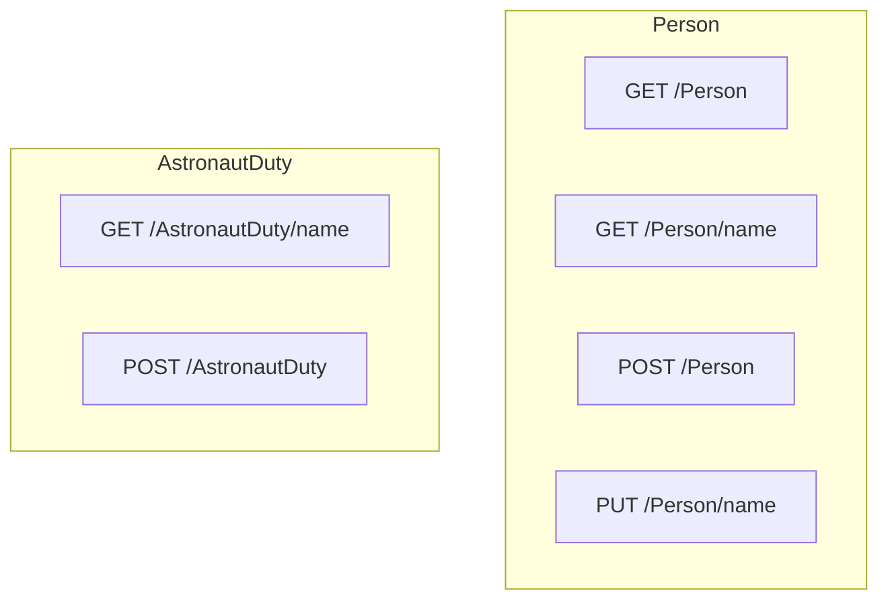
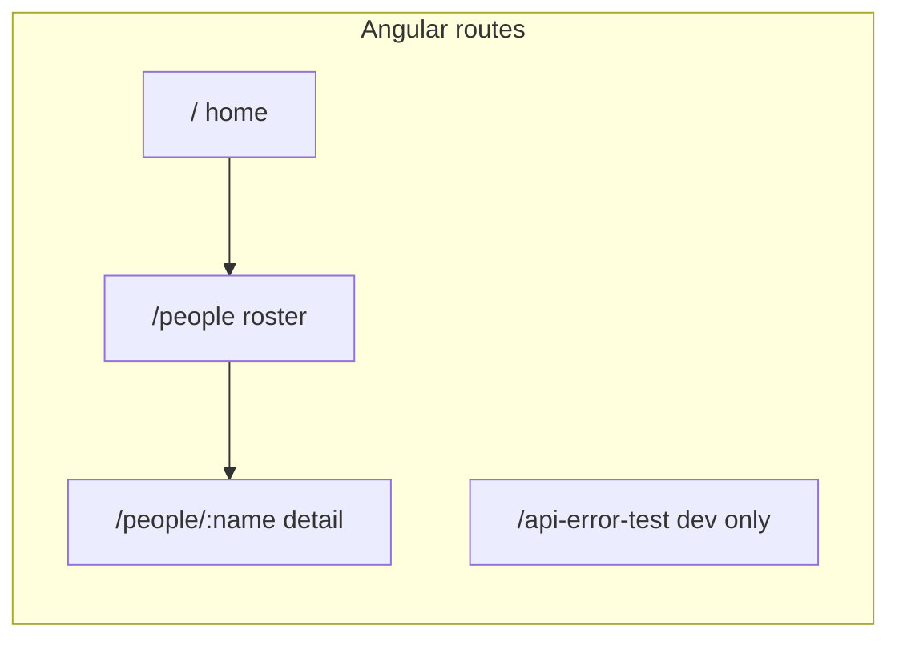

## Solution layout

Exercise 1 is under [`exercise1/`](exercise1/).

| Piece | Location | Notes |
|--------|----------|--------|
| **API** | [`exercise1/api/`](exercise1/api/) | ASP.NET Core **StargateAPI** (SQLite, MediatR, Swagger in Development). |
| **Tests** | [`exercise1/tests/StargateAPI.Tests/`](exercise1/tests/StargateAPI.Tests/) | xUnit integration tests with `WebApplicationFactory` and SQLite. |
| **UI** | [`exercise1/ui/`](exercise1/ui/) | Angular ACTS app; **not** part of the Visual Studio solution file. |

The solution file [`exercise1/exercise1.sln`](exercise1/exercise1.sln) includes **StargateAPI** and **StargateAPI.Tests** only. Open or run the UI separately from [`exercise1/ui/`](exercise1/ui/) (see [`exercise1/ui/README.md`](exercise1/ui/README.md)).

### Run locally

- **API**: From `exercise1/api`, `dotnet run` (HTTP profile uses `http://localhost:5204`; Swagger UI is available in Development).
- **Tests**: From `exercise1` or the test project folder, `dotnet test`. Optional coverage (Coverlet is referenced):  
  `dotnet test exercise1/tests/StargateAPI.Tests/StargateAPI.Tests.csproj --collect:"XPlat Code Coverage"`  
  (reports land under the test project’s `TestResults/` folder).
- **UI**: From `exercise1/ui`, `npm install` then `npm start` (`http://localhost:4200`; expects the API at `http://localhost:5204`).

---

## API (StargateAPI)

### HTTP surface

Use **Swagger** (`/swagger`) in Development for request/response schemas. The table below is a navigation aid only.

| Method | Path | Purpose |
|--------|------|---------|
| `GET` | `/Person` | List people (with astronaut summary join). |
| `GET` | `/Person/{name}` | Person by name. |
| `POST` | `/Person` | Create person (JSON string body). |
| `PUT` | `/Person/{name}` | Update person name. |
| `GET` | `/AstronautDuty/{name}` | Duties for a person by name. |
| `POST` | `/AstronautDuty` | Create astronaut duty. |

### What changed (summary)

- **Date modeling**: `DateOnly` on relevant entities, DTOs, and commands; Dapper type handlers registered in `Program.cs`.
- **Defensive programming**: MediatR preprocessors validate and normalize input (required fields, trim, duplicate and rule checks) on create/update commands; handlers use guard clauses, transactions for multi-step duty updates, conditional queries (e.g. skip duties when person is missing), and controlled handling of `DbUpdateException` where persistence can conflict.
- **Parameterized SQL (Dapper)**: Raw reads use `@Name`, `@PersonId`, and similar with Dapper parameter objects, not string-concatenated user input; `GetPeople` uses static SQL only; writes use EF Core (parameterized commands).
- **Person identity**: Unique `Name` at the EF level; create/update paths validated in preprocessors.
- **Astronaut duty rules**: Duplicate duty (same title + start date) rejected; `RETIRED` sets career end to the day before duty start; new duty closes the previous duty’s end date; duty start chronology enforced; work wrapped in a transaction where needed.
- **EF relationships / constraints**: Configured on `AstronautDuty`, `AstronautDetail`, and related migrations (including rule/logging hardening).
- **Process logging**: `ProcessLog` rows via `ProcessLogWriter` (dedicated scope per write); middleware logs outcome levels by status code.
- **Errors**: `ClientInputException` for client mistakes vs server failures; centralized handling in `ExceptionHandlingMiddleware`.
- **`UpdatePersonByName`**: Implemented and wired from `PersonController`.
- **Queries**: `GetAstronautDutiesByName` returns success with null person and empty duties for unknown names; list/detail queries avoid redundant nested DTO hydration where noted in code.
- **Hosting**: SQLite under `App_Data` when the connection string is not rooted; seed only when the database is empty (`StargateSeeder`).
- **SPA development**: Development-only CORS for `http://localhost:4200`.
- **Integration tests**: `public partial class Program` for `WebApplicationFactory`.

---

## Tests (StargateAPI.Tests)

Integration tests target the real pipeline with **`WebApplicationFactory`** and **SQLite** ([`ApiRuleAndLoggingTests.cs`](exercise1/tests/StargateAPI.Tests/ApiRuleAndLoggingTests.cs)).

- **Rule-based**: Mirror the written business rules—e.g. no astronaut rows until a duty exists, duplicate person name rejected, first `RETIRED` duty and career end date, duplicate duty rejected, previous duty end dates when adding a new duty.
- **Coverage-oriented**: Chronology and required-field validation, person not found, name trimming, GET contracts for unknown names and people without assignments, `UpdatePersonByName` success and failure paths, and **process logging** (UTC timestamps, success vs error, Warning for framework-generated bad requests).

---

## UI (ACTS)

Angular app: feature folders under `src/app/` (`core`, `shared`, `features`). Details, scripts, and API error/toast behavior: [`exercise1/ui/README.md`](exercise1/ui/README.md).

